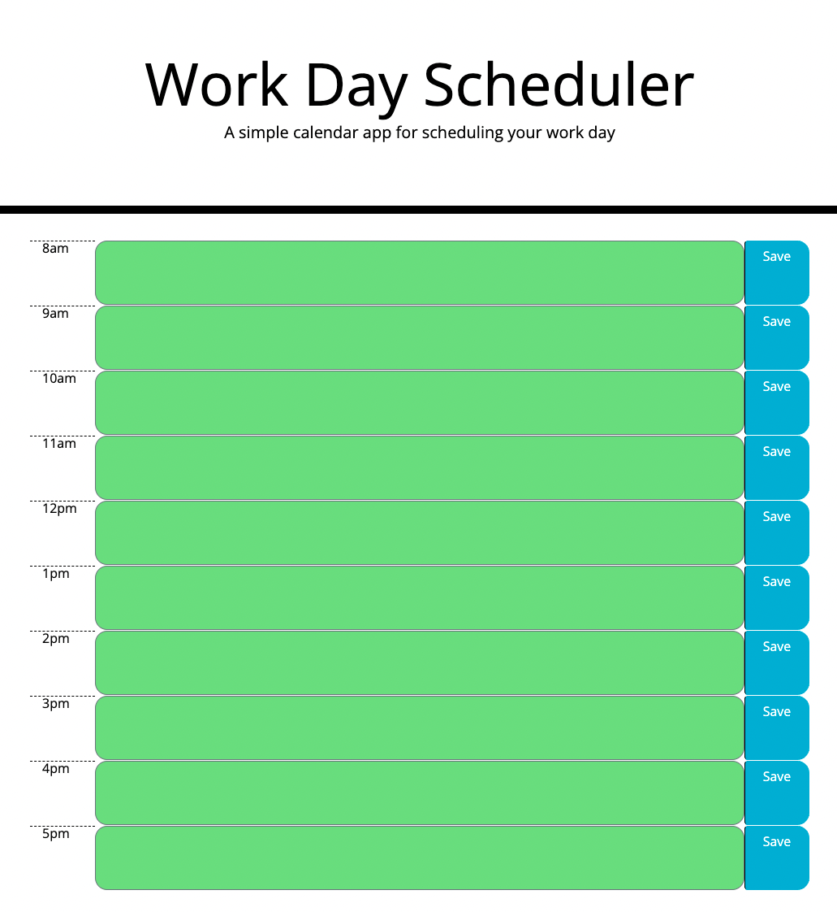
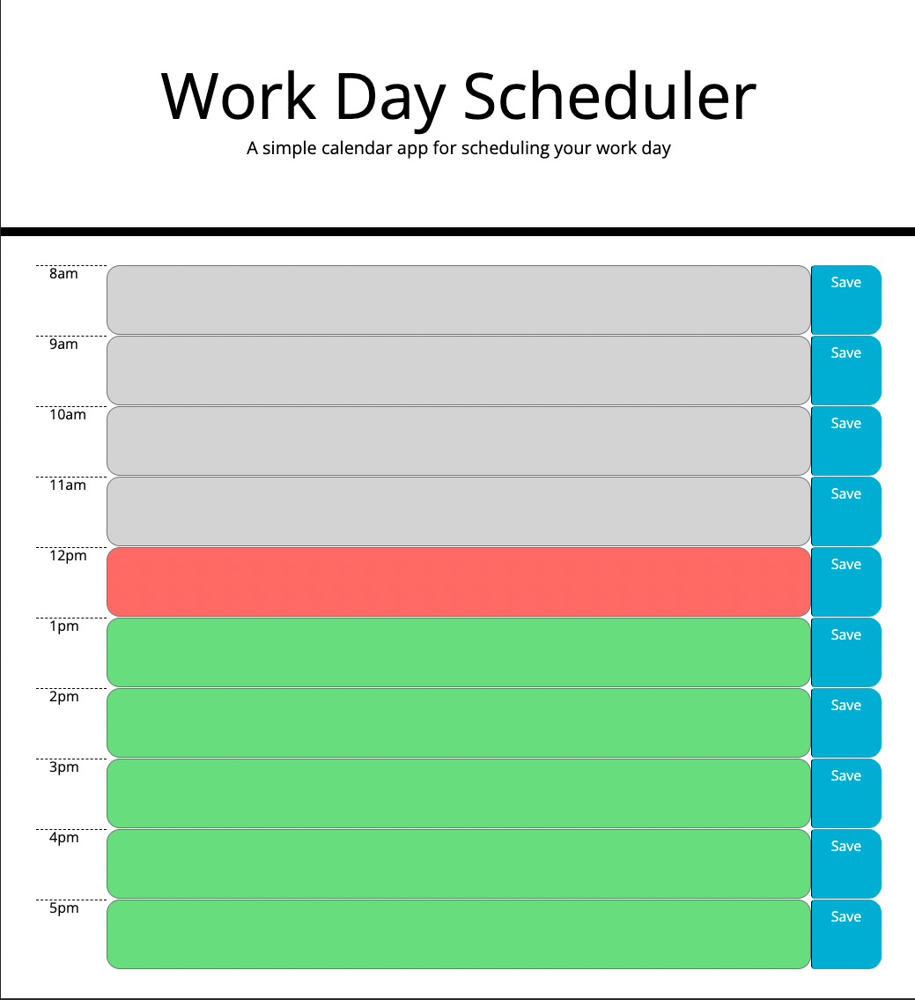
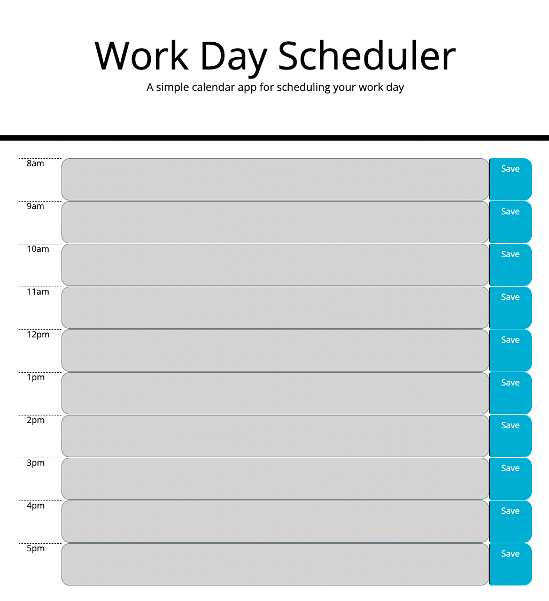
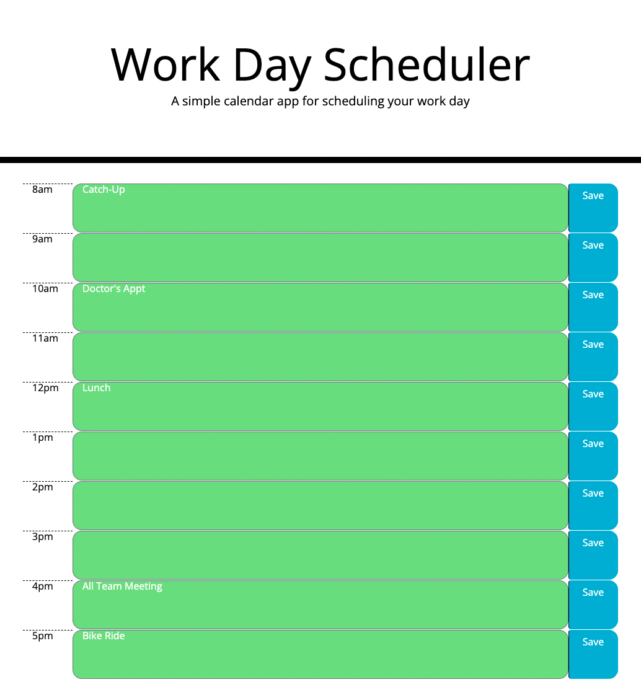
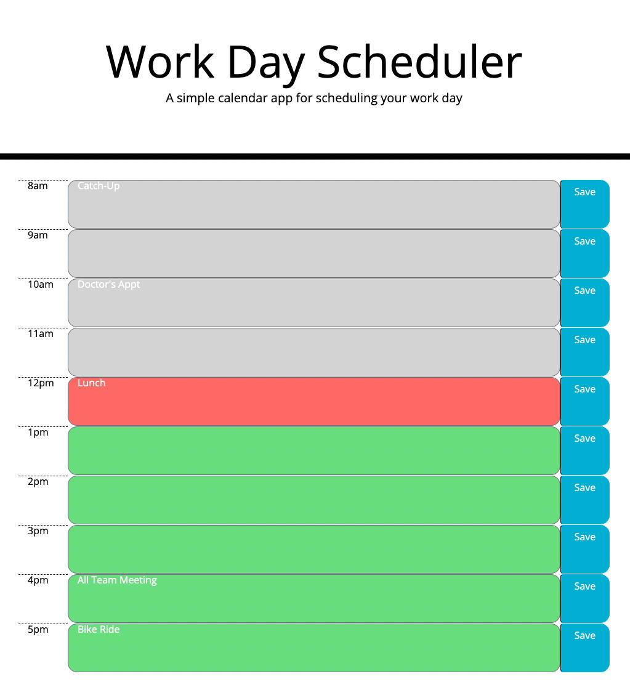
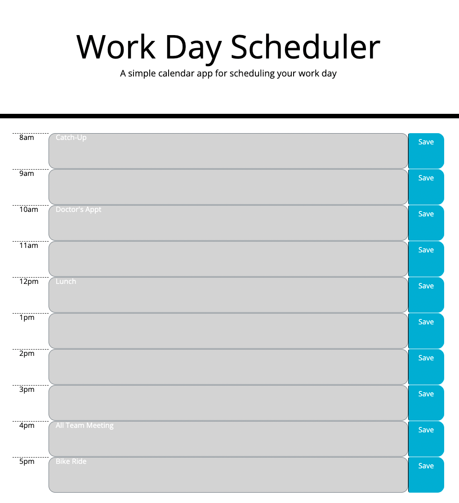

# workDayScheduler

## The Task

Create a simple calendar application to save events to the hour given some starter code.

## Acceptance Criteria

```
GIVEN I am using a daily planner to create a schedule
 21 WHEN I open the planner
 22 THEN the current day is displayed at the top of the calendar
 23 WHEN I scroll down
 24 THEN I am presented with timeblocks for standard business hours
 25 WHEN I view the timeblocks for that day
 26 THEN each timeblock is color coded to indicate whether it is in the past, present,     or future
 27 WHEN I click into a timeblock
 28 THEN I can enter an event
 29 WHEN I click the save button for that timeblock
 30 THEN the text for that event is saved in local storage
 31 WHEN I refresh the page
 32 THEN the saved events persist
```

## Screenshots













## Links

Github: https://github.com/aaaziz2/workDayScheduler

Direct Link: https://aaaziz2.github.io/workDayScheduler/